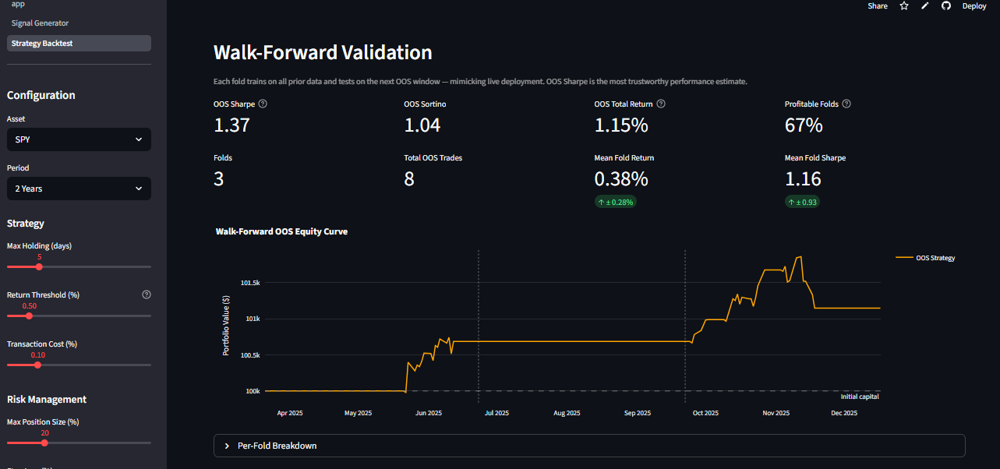

# Equity Signal Engine

[](https://github.com/craft-b/equity-signal-engine/actions/workflows/test.yml)

A production-style ML trading system demonstrating end-to-end ML engineering in finance — from raw market data to a live interactive dashboard.

## Demo



**[Live demo](https://equity-signal-engine-ajalyncnnkbsqpdfhkdtjd.streamlit.app)**

## Quickstart

```bash
git clone https://github.com/craft-b/equity-signal-engine.git
cd equity-signal-engine
pip install -r requirements.txt        # app only
# pip install -r requirements-dev.txt  # includes jupyter + pytest
streamlit run stock_dashboard/app.py
```

## Overview

This project builds a supervised learning pipeline for short-term equity direction prediction, backed by a realistic event-driven backtest engine. The goal is to showcase ML engineering patterns applicable to systematic trading infrastructure.

**Capabilities:**
- Sklearn-compatible data pipeline with configurable technical indicator computation, outlier capping, missing-data handling, and feature selection
- Binary classifier (Random Forest or Logistic Regression) trained with proper time-series cross-validation (no look-ahead)
- Event-driven backtest engine with position sizing, stop-loss/take-profit, transaction costs, and long/short support (NumPy-vectorized loop, 4–9x faster than naive pandas iteration)
- Walk-forward OOS validation with per-fold breakdown and overfitting detector
- Bootstrap Sharpe 95% CI (1 000 resamples) and t-test for mean return significance
- Volatility regime detection (rolling percentile) with per-regime trade performance breakdown
- Multi-page Streamlit dashboard for interactive strategy exploration

## Project Structure

```
equity-signal-engine/
├── stock_dashboard/
│   ├── app.py                  # Streamlit entry point (landing page)
│   ├── pages/
│   │   ├── 1_Signal_Generator.py   # ML model training + signal view
│   │   └── 2_Strategy_Backtest.py  # Backtest configuration + results
│   ├── data_pipeline.py        # Data fetching + sklearn Pipeline
│   ├── models.py               # Model training + evaluation
│   ├── backtest.py             # Event-driven backtest engine (vectorized)
│   ├── walk_forward.py         # Walk-forward OOS validation engine
│   ├── stats.py                # Bootstrap Sharpe CI + significance testing
│   ├── regimes.py              # Volatility regime detection + per-regime stats
│   └── utils.py                # Plotly chart builders
├── tests/
│   ├── test_data_pipeline.py   # 28 tests
│   ├── test_models.py          # 23 tests
│   ├── test_backtest.py        # 31 tests
│   ├── test_walk_forward.py    # 13 tests
│   ├── test_stats.py           # 18 tests
│   ├── test_regimes.py         # 21 tests
│   └── test_benchmark.py       # 5 tests (timing + equivalence)
├── notebooks/
│   └── jane_trading.ipynb      # Exploratory analysis
├── .github/workflows/
│   └── test.yml                # CI: pytest on every push
├── requirements.txt
└── README.md
```

## Tests

140 tests across the full pipeline, run automatically on every push:

```bash
pytest tests/
```

## Tech Stack

| Component | Technology |
|-----------|------------|
| Data | Yahoo Finance (`yfinance`) |
| Feature engineering | `pandas`, `numpy`, custom sklearn transformers |
| ML models | `scikit-learn` (Random Forest, Logistic Regression) |
| Statistics | `scipy` (bootstrap CI, t-test) |
| Backtesting | Custom event-driven engine (NumPy-vectorized) |
| Dashboard | `streamlit`, `plotly` |
| CI | GitHub Actions |

## Key Design Decisions

- **No look-ahead bias**: target variable is a forward-shifted return; pipeline steps are fit only on training data
- **Price columns never scaled**: Close/Open/High/Low remain in dollar terms for backtest accuracy
- **Time-series CV**: `TimeSeriesSplit` throughout — no random shuffling of temporal data
- **Depth-constrained Random Forest**: `max_depth=5`, `min_samples_leaf=25` to resist overfitting on noisy financial data

## Disclaimer

For educational and research purposes only. Not financial advice.
